# SystemVi
A project containing source code for:
 - systemvi game engine
 - games
 - mechanical keyboard firmware
 - website
 - server
 ## Download
```
git clone https://github.com/UrosSysPro/systemVI.git
cd systemVI 
gradle build
```
### Run Examples
From the root of the project
```
gradle :examples:example_name:run
```
`example_name` can be name of any dir in examples:<br>
`gradle :examples:fluid:run`<br>
`gradle :examples:fabrik:run`<br>

### Run Website Locally
From the root of the project
```
cd website
npm install 
npm run dev
```
### Compile a Release
From the root of the project
`gradle :examples:compile-release`

### Run Voxels
```
gradle :voxel-world:run
```

## Screenshots
### Box2d
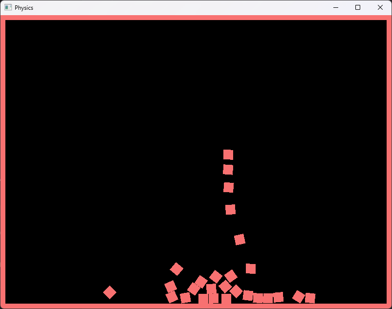
### Ray Marching (cpu)
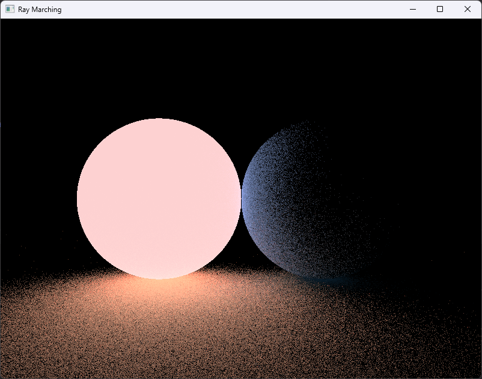
### Ray Marching (compute shader)
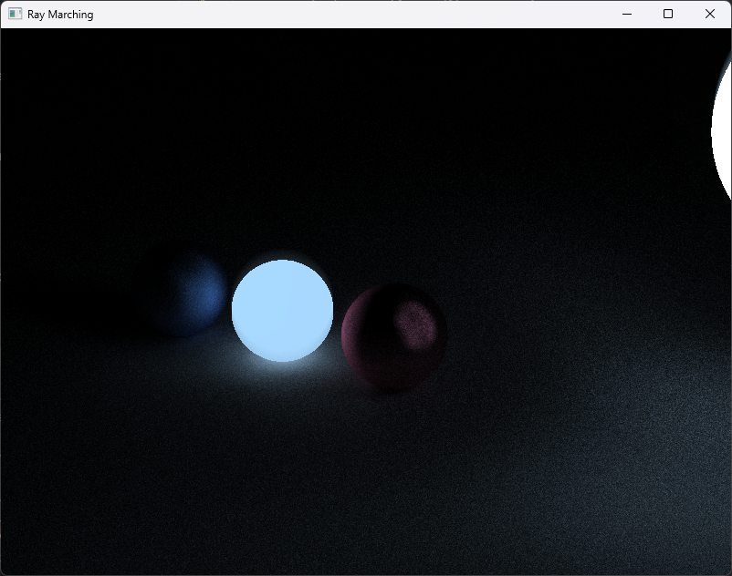
### Model Importer 
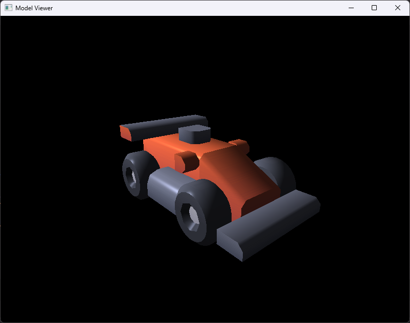
### Maze
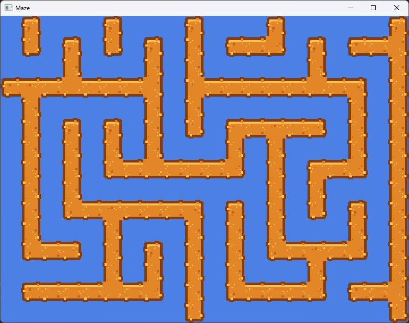
#### Mandelbrot Set (fragment shader)
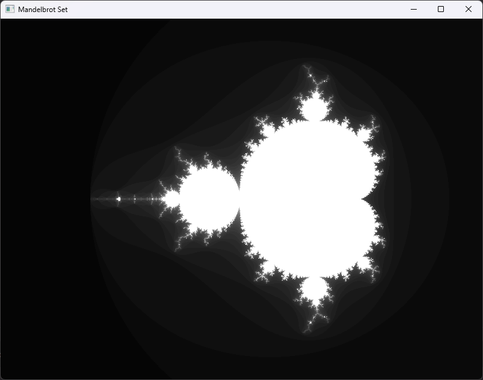
## Julia Set (fragment shader)
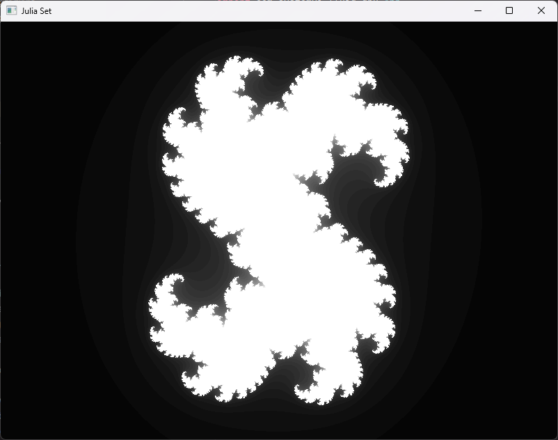
## Fluid Simulation (cpu)
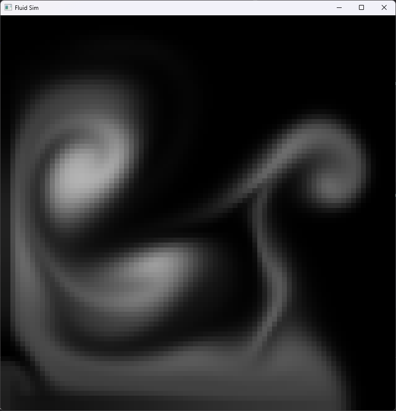
## Fluid Simulation (gpu)
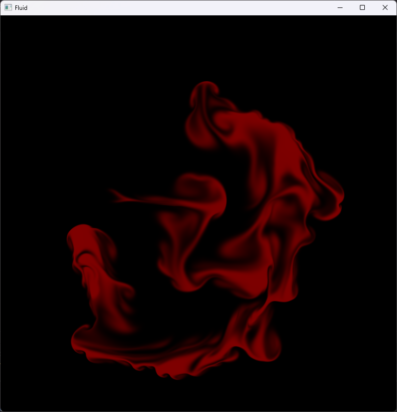
## Fabrik (forward and backward reaching inverse kinematics)
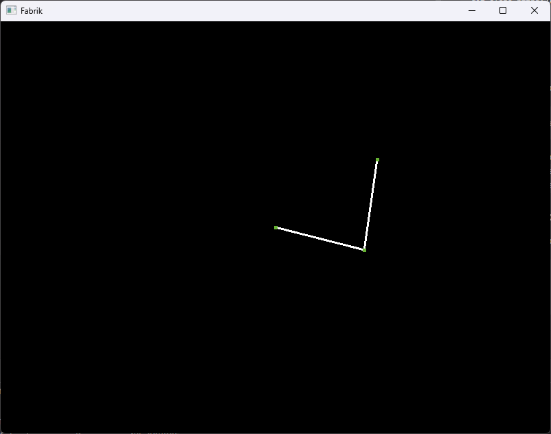
## Atari Break Out
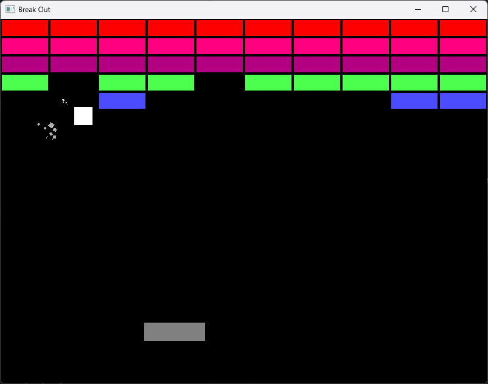
## Reaction Diffusion 
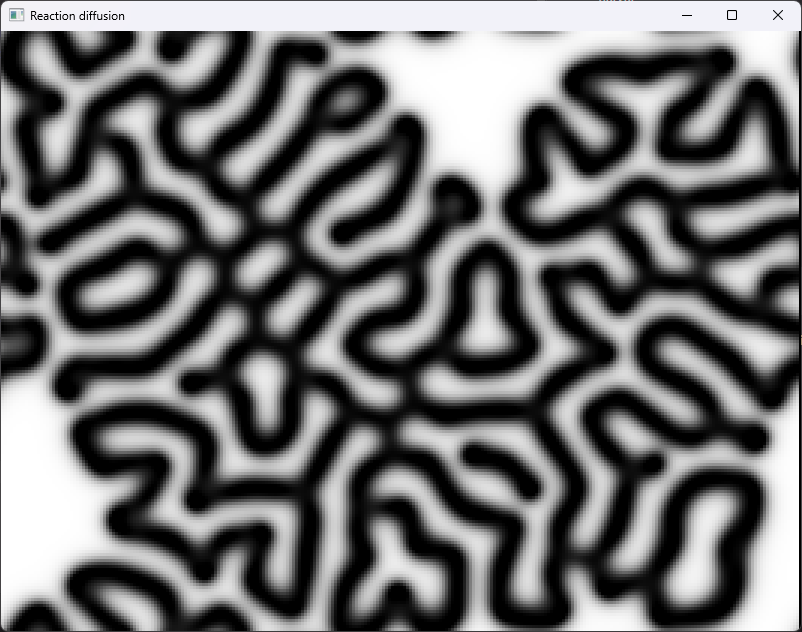
## Phong Shading With Normal Mapping
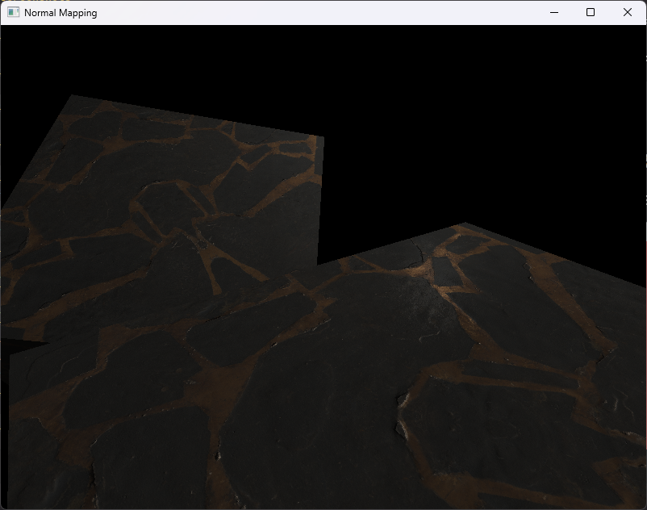
## Phong Shading With Normal Mapping


