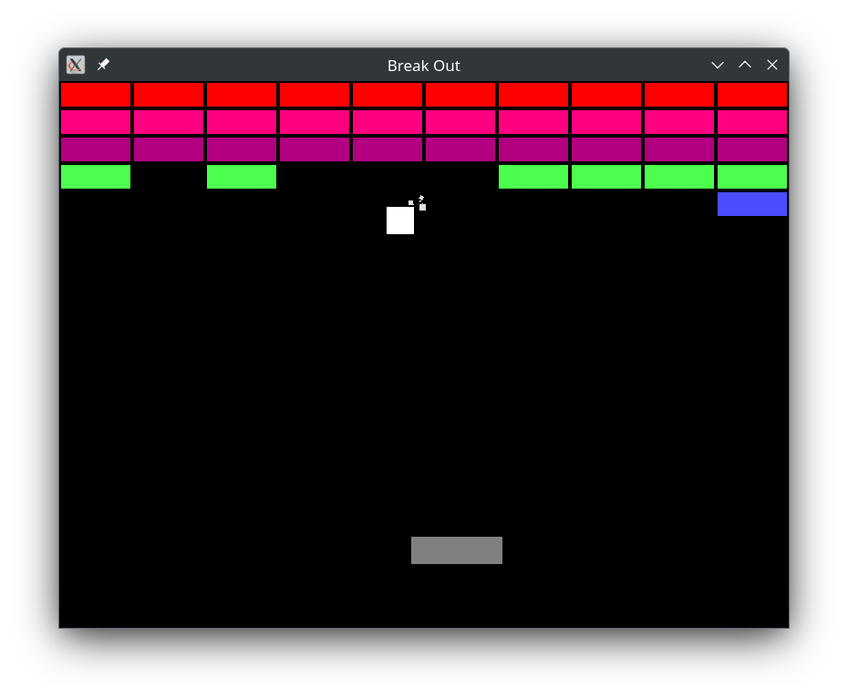

## Breakout

U igrici od objekata imamo igraca, loptu i blokove.
Svaka igrica ima dve funkcije, setup i loop.
Loop ima zadatak da 60 puta po sekundi procita unos sa tastature i misa (input),
pomeri sve stvari na ekranu (update), ocisti ceo ekran i ponovo nacrta sve objekte
(draw).
<br><br>
Napravicemo po jednu klasu za svaki objekat u igri.

```java 
class Player{
    public float x,y,width,heigth;
    public Vector4f color;
 
    public Player();
    public void draw(ShapeRenderer renderer);
}
```

U `setup` funkciji igrac se postavi horizontalno na sredinu pri dnu ekrana,
`x` koordinata je uvek jednaka poziciji misa, `y` se ne menja tokom igre. Pozicija se jednostavno postavlja u input delu koda.

```java
class Wall{
       public static float width=80,height=20;
       public float x,y;
       public Vector4f color;
       public boolean visible;
       public Wall(float x,float y);
       
       public void draw(ShapeRenderer renderer);
}
```
`Wall` se na pocetku igre postavlja na mesto, svi blokovi imaju istu velicinu, zato su `width` i `height` `static`.
Blokovi takodje cuvaju i informaciju da li su vidljivi, postanu nevidljivi kada se sudare sa loptom.

```java
class Ball{
    public float x,y,r,vx,vy;
    public Vector4f color;
    
    public Ball();
    public void update(float delta,Wall[][] walls,Window window, Player player);
    public void draw(ShapeRenderer renderer);
}
```

Loptu opisuju pozicija, poluprecnik, boja i brzina. Za razliku od bloka (koji se ne pomera) i igraca (koji prati mis), lopta 
ima svoju brzinu. Brzina u svakom smeru moze da se rastavi na dve komponente, `x` i `y` osu. 
Brzina je promena pozicije tokom vremena, u programu update funkcija se poziva 60 puta po sekundi, i tu menjamo poziciju lopte.
```java 
public void update(float delta,Wall[][] walls,Window window, Player player){
    x+=vx;
    y+=vy;
}
```
U ovom slucaju sve ce raditi super, ako stavimo da su `vx` i `vy` 1 lopta ce se kretati 60 piksela u stranu i 60 piksela na dole po sekundi.
Problem nastaje kada imamo neku komplikovaniju igricu, ili ako imamo dosta pokrenutih programa, desava se da je fps nestabilan.
U opstem slucaju nije garantovano da ce igrica uvek raditi na tacno 60fps. Zato moze da se desi da u jednoj sekundi lopta predje 40 piksela,
a u sledecoj 70 piksela, da usporava i ubrzava u zavisnosti od fps. Zato brzinu izrazavamo u pikselima po sekundi.
`float delta` kao parametar predstavlja broj sekundi koji je prosao od prethodnog frejma. Ovaj broj je uglavnom oko `0.016`, 
oko 16ms, jer je 1000ms/60fps~16ms po frejmu. Sada mozemo brzinu da pomnozimo sa delta, i sa ovim je zagarantovano da se krece istom brzinom nezavisno od fps.
```java 
public void update(float delta,Wall[][] walls,Window window, Player player){
    x+=vx*delta;
    y+=vy*delta;
}
```
U update se salju i blokovi, igrac i prozor, za svaki od ovih objekata proverimo da li se sudaraju sa loptom i u tom slucaju promenimo smer lopte.
Ako se sudara sa blokom, pored promene smera, i blok postavimo da je nevidljiv.
<br><br>
Ostaje da to sve spojimo u jedan program.

```java

public class BreakOut extends Application {
    //treba dodati window renderer i kameru
    Player player;
    Wall[][] walls;
    Ball ball;

    @Override
    public void setup() {
        //setapovati window, renderer i kameru
        
        player=new Player(window.getWidth(),window.getHeight());
        walls=new Wall[10][5];
        Vector4f[] colors=new Vector4f[]{
            new Vector4f(1,0,0,1),
            new Vector4f(1,0,0.5f,1),
            new Vector4f(0.7f,0,0.5f,1),
            new Vector4f(0.3f,1,0.3f,1),
            new Vector4f(0.3f,0.3f,1f,1),
        };
        for(int i=0;i<walls.length;i++){
            for(int j=0;j<walls[i].length;j++){
                walls[i][j]=new Wall(i*Wall.width,j*Wall.height,colors[j]);
            }
        }
        ball=new Ball(window.getWidth(),window.getHeight());
    }

    @Override
    public void loop(float delta) {
        //update
        ball.update(delta,walls,window,player,particleSimulation);
        
        //obrisati ekran
        //draw
        for(int i=0;i<walls.length;i++){
            for(int j=0;j<walls[i].length;j++){
                if(walls[i][j].visible)
                    walls[i][j].draw(renderer);
            }
        }
        player.draw(renderer);
        ball.draw(renderer);
        
        renderer.flush();
    }
}
```


Cilj je napraviti klasu za svaki objekat na ekranu, i svakom objektu definisati `input`, `update` i `draw` metode ako treba.


