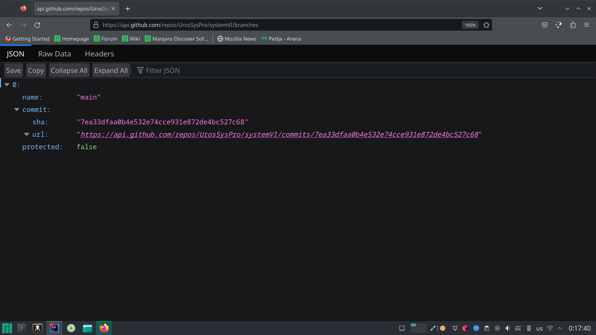

# OpenGL
OpenGL je api pomocu kog komuniciramo sa drajverom za graficku karticu.
## API
Api (application programing interface) predstavlja neki 
dogovoren nacin na koji dve aplikacije komuniciraju. Ne postoji univerzalni nacin da se definise api.
Do sada smo se susreli sa raznim primerima, kao sto je DOM u java scriptu i REST API.
### DOM
DOM (Document Object Model) je interfejs pomocu kod mozemo da menjamo html elemente i css osobine na sajtu.
DOM definise globalnu promenljivu `document`, i koristeci metode kao sto su `document.getElementById();` i 
`document.createElement();` mozemo da pronalazimo i pravimo nove elemente na stranici.

### REST API
Rest api je jedan od najcescih nacina na koji sajtovi komuniciraju sa serverom.
Ideja je da server definise adrese na koje korisnici mogu da salju http request-ove, i kao rezultat dobiju neki tekst,
najcesce informaciju u json formatu.
Jedan primer je github. 



### C API
Graficka kartica ima svoje napajanje, svoju ram memoriju, svoj procesor i svoj firmver(firmver moze da se smatra kao 
operativni sistem za graficku karticu). Moze se reci da je graficka kartica kompjuter unutar kompjutera.
Opengl definise gomilu funkcija pomocu kojih mozemo da upravljamo tim hardverom.

## GLFW
Funkcije koje upravljaju memorijiom i programima na grafickoj su univerzalni za sve operativne sisteme,
ali svaki operativni sistem definise svoj api za kreiranje prozora i citanje unosa sa misa i tastature.
GLFW je biblioteka koja resava ovaj problem.
<br>
Na pocetku svakog programa moramo da pozovemo 4 funkcije, kako bi rekli programu koju verziju opengl-a koristimo.
```java 
glfwInit();
glfwWindowHint(GLFW_CONTEXT_VERSION_MAJOR,3);
glfwWindowHint(GLFW_CONTEXT_VERSION_MINOR,3);
glfwWindowHint(GLFW_OPENGL_PROFILE,GLFW_OPENGL_CORE_PROFILE);
```
Zelimo da koristimo verziju 3.3, jer je to najpopularnija verzija, radi na najvecem broju racunara.
Version major predstavlja broj pre tacke, version minor broj posle tacke. 
Ako bi smo hteli da koristimo verziju 4.6 (najnovija verzija) napisali bi:
```java 
glfwWindowHint(GLFW_CONTEXT_VERSION_MAJOR,4);
glfwWindowHint(GLFW_CONTEXT_VERSION_MINOR,6);
```
Sa Opengl core profile naglasavamo da ne koristimo neke stare funkcije koje su postojale u 2.0 i 1.0 a izbacene su u novijim verzijama.


Sa nekoliko funkcija mozemo da napravimo prozor:
```java 
long window=glfwCreateWindow(800,600,"Window",0,0);
glfwMakeContextCurrent(window);
GL.createCapabilities();
glViewport(0,0,800,600);
```

Kada napravimo prozor dobijamo id, u ovom slucaju `long window`,
svaki sledeci put kada menjamo nesto u vezi prozora saljemo ovaj id kao parametar.
<br>
<br>
Ako sada pokrenemo program prozor se otvori na nekoliko milisekundi i odmah zatvori.
Da bi prozor ostao duze vreme otvoren mozemo da napisemo petlju koja ce da se ponavlja sve dok korisnik ne klikne x u cosku.
```java
while(!glfwWindowShouldClose(window)){
    //input
    //update
    //draw
    Thread.sleep(16);
}
```
Ova petlja se naziva game loop, i izvrsava se za vreme celog programa.
Cim se petlja zavrsi i program se zavrsava, osim ako nemamo nesto da sacuvamo na ssd (checkpoint u igrici).
<br><br>
`Thread.sleep(16)` pauzira program na 16ms (milisekundi). Ako ne stavimo ovu liniju procesor ce sve vreme raditi na 100%.
Takodje nema potrebe da se igrica izvrsava brze od brzine monitora.
<br><br>

Postoje dva nacina da proverimo user input, preko event listener-a ili tako sto proveravamo da li je neki taster pritisnu.
Na casu smo radili samo preko event listenera, najznacajniji su nam mis, tastatura i window resize.
```java

glfwSetFramebufferSizeCallback(window,(long window, int width, int height)->{
    glViewport(0,0,width,height);
    //resize
});
glfwSetKeyCallback(window, (long window, int key, int scancode, int action, int mods)->{
    //key press/release
});
glfwSetCursorPosCallback(window,(long win,double x,double y)->{
    //mouse move
});
```

Da bi se ovi eventovi pozvali potrebno je da u game loop negde stavimo liniju `glfwPollEents(window)`.