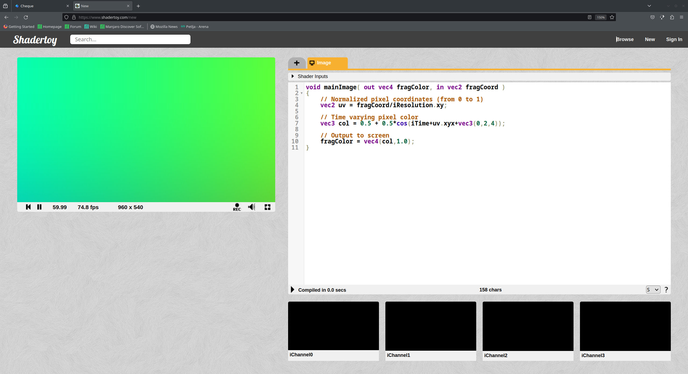
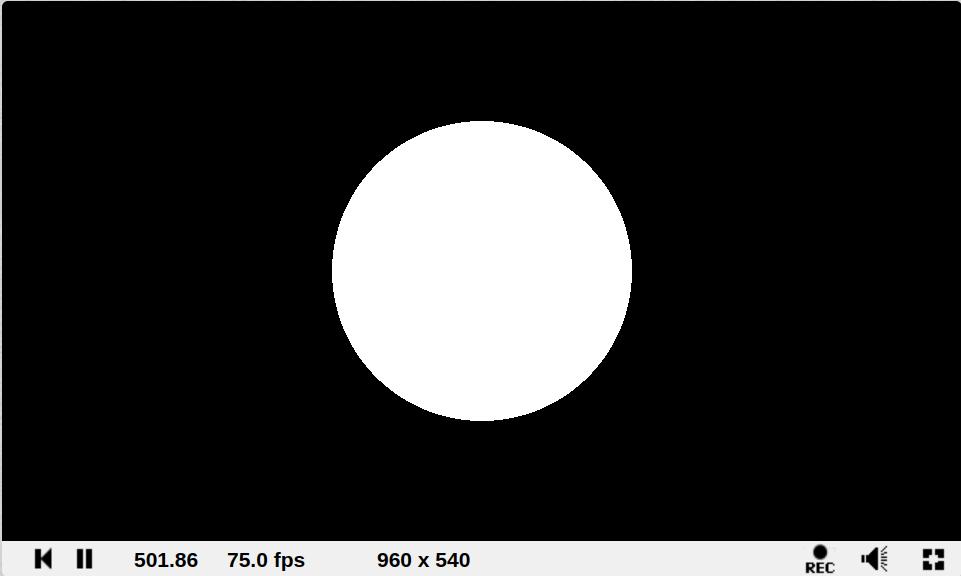
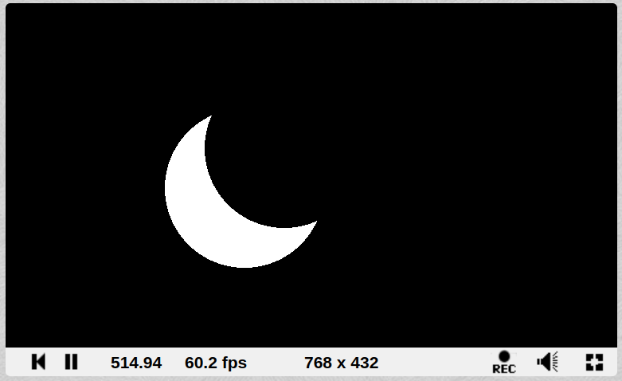

## Shader toy
Shader toy je sajt na kom mozemo da testiramo i pronadjemo shader-e koje su drugi pisali.

Na levoj strani je pravougaonik u kome je svaki piksel obojen bojom koju izracuna fragment shader, na desnoj je editor
u kome pisemo fragment shader. Shader toy definise main funkciju sa potpisom `void mainImage(out vec4 fragColor,in vec2 fragCoord)`,
i uniforme koje predstavljaju korisnicki input za shader. Imena uniformi pocinju sa i (oznacava input).
+ `iMouse` - vektor u kom x i y predstavljaju poziciju misa u pikselima.
+ `iResolution` - vektor u kom x i y predstavljaju rezoluciju kvadrata u pikselima.
+ `iTime` - float koji predstavlja vreme u sekundama od kada je shader pokrenut.
+ `iChannel0, iChannel1, iChannel2` - sampler2D, slike (texture) koje mozemo da posaljemo kao input.

Na sajtu ima dosta primera gde su ljudi pravili 2d i 3d animacije koristeci samo ovaj jedan fragment shader.
Shader toy zahteva poseban nacin razmisljanja, jer treba da napisemo jedan algoritam koji se izvrsava za svaki piksel i daje razlicit rezultat
u zavisnosti od pozicije tog piksela.

## Signed distance field
2d i 3d oblici mogu da se definisu kao niz duzi i mnogouglova(kocka - 6 kvadrata, trougao - 3 duzi). Drugi nacin da definisemo mnogougao ili
poliedar je kao skup tacaka u 2d ili 3d prostoru koje ispunjavaju neki uslov (kruznica je skup tacaka od kojih je svaka ja jednakoj udaljenosti od centra).
SDF je implementacija ove ideje, svakoj tacki u prostoru dodelimo jedan float, ako je float negativan tacka je unutar oblika,
ako je pozitivan tacka je van oblika, ako je 0 tacka je tacno na ivici oblika, aplosutna vrednost ovog float-a je udaljenost 
te tacke od ivice oblika. Ovaj nacin predstavljanja geometrije je pogodan za graficku, jer mozemo sve tacke u prostoru paralelno da ispitamo 
da li su unutar oblika. Signed distance function je funkcija koja vraca udaljenost date tacke od ivica nekog oblika, na internetu mogu da se nadju
funkcije za razne oblike.

[2d signed distance functions](https://iquilezles.org/articles/distfunctions2d/)<br>
[3d signed distance functions](https://iquilezles.org/articles/distfunctions/)

U kodu definisemo dve funkcije `circleSdf` i `translate`, prva vraca udaljenost tacke `p` od kruga poluprecnika `r` koji je centriran
u koordinatnom pocetku, druga funkcija translira ceo koordinatni sistem (ako zelim da nacrtam krug na poziciji 200,300 moram koordinatni pocetak da pomerim u tu tacku,
zato se novi centar oduzima od pozicije, isto kao i kod obicnog renderovanja).
```glsl
float circleSdf(vec2 p, float r){
    return length(p)-r;
}
vec2 translate(vec2 p, vec2 t){
    return p-t;
}

void mainImage( out vec4 fragColor, in vec2 fragCoord )
{
    vec4 color;
    vec2 center=iResolution.xy/2.0;
    
    float d=circleSdf(
        translate(fragCoord,center),
        150.0
    );
    
    if(d>0.0){
        color=vec4(0.0);
    }else{
        color=vec4(1.0);
    }
    
    fragColor = color;
}
```



## Spajanje skupova
Posto geometrijske oblike definisemo kao skup tacaka, mozemo da primenjujemo operacije unije, preseka, razlike... i spajanjem jednostavnih oblika dobijemo
komplikovanije.

### Union
Unija dva skupa se dobija kao minimum dve sdf funkcije.
```glsl
float union(float d0,float d1){
    return min(d0,d1);
}
```
### Intersection
Presek se dobija kao maksimum dve funkcije.
```glsl
float intersection(float d0,float d1){
    return max(d0,d1);
}
```

### Complement
Komplement (sve sto nije u skupu) se dobija tako sto obrnemo znak
```glsl
float complement(float d){
    return -d;
}
```
### Difference
Razlika se dobija kao presek prvog skupa i komplementa drugog
```glsl
float difference(float d0,float d1){
    return max(d0,-d1);
}
```
### Smooth union
Varijanta unije koja zaobli uglove oblika koji se spajaju
```glsl
float smoothUnion(float a, float b, float k) {
    float h = max(k - abs(a-b), 0.) / k;
    return min(a, b) - h*h*h*k*1./6.;
}
```
### Outline
```glsl
float outline(float d,float w){
    return abs(d)-w;
}
```
Pretvara bilo koji oblik u ivicu tog oblika(krug u kruznicu...)
### Mix
`float mix(d0,d1,alpha)` je funkcija koja je ugradjena u opengl i vraca (1-alpha)\*d0+alpha\*d1, sa ovim
pomocu alpha animiramo jedan oblik u drugi.

## Moon
```glsl
float difference(float d0,float d1){
    return max(d0,-d1);
}

float circleSdf(vec2 p, float r){
    return length(p)-r;
}
vec2 translate(vec2 p, vec2 t){
    return p-t;
}


void mainImage( out vec4 fragColor, in vec2 fragCoord )
{
    vec4 color;
    float d=difference(
        circleSdf(
            translate(fragCoord,vec2(300.0,200.0)),
            100.0
        ),
        circleSdf(
            translate(fragCoord,vec2(350.0,250.0)),
            100.0
        )
    );

    if(d>0.0)
        color=vec4(0.0);
    else
        color=vec4(1.0);
        
    fragColor=color;
}
```

Mesec se dobija kao razlika dva trougla, ako je tacka unutar(d je manje od 0) piksel se oboji u belo, ako je d negativno 
piksel se oboji u crno.
