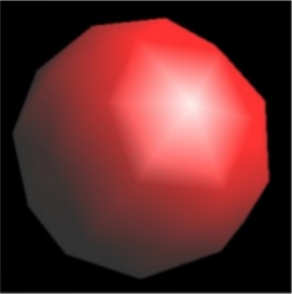

## Lighting
U 3d grafici boja svakog piksela zavisi od svetlosti koja dolazi do tog dela scene i osobina materijala.
Ukupna svetlost koja dolazi do neke tacke u sceni jednaka je zbiru direktne i indirektne svetlost.
Direktno osvetljenje predstavljaju fotoni koji direktno stizu od izvora svetlosti, a indirektno predstavljaju svi fotoni
koji se bar jednom odbiju negde u sceni pre nego sto dodju u datu tacku. Najjednostavniji nacin (koji daje i najbolje rezultate)
jeste da simuliramo svaki foton kako se odbija u sceni. Ovaj nacin renderovanja se zove ray tracing.
  
Mana ovakvog pristupa je sto ima previse izracunavanja da bi program radio u realnom vremenu (60fps), zato moramo da odaberemo
neki nacin renderovanja koji zahteva manje izracunavanja a daje slicne rezultate. U vecini igrica se danas koristi 
neka od rasterskih metoda.

### Flat shading
Flat shading je model renderovanja kod kog u napred odredimo sa koje strane je model osvetljen, i kao vertex atribut
dodamo kolicinu svetlosti koja dolazi do te tacke (vertex-a). Osvetljenje svakog piksela unutar trougla se dobija 
interpolacijom temena trougla.

### Phong shading 
Phong shading je jedan od najpopularnijih nacina renderovanja u igricama. U ovom modelu svetlost se opisuje sa 3 komponente
ambient, diffuse i specular. Diffuse i specular su aproksimacije direktnog osvetljenja a ambient je aproksimacija indirektnog.
Ambient je najjednostavnija komponenta, kod ovakvog nacina renderovanja predpostavljamo da odredjena kolicina svetlosti 
stize do svake tacke u sceni. Kod direktnog osvetljenja, u zavistnosti od tipa materijala, neki deo svetlost se odbije 
pod istim uglom, a neki deo se rasipa u svim smerovima,